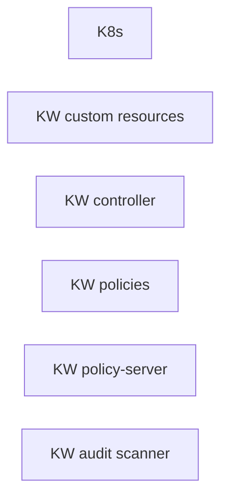

<!--
<head>
  <link rel="canonical" href="https://docs.kubewarden.io/explanations/architecture"/>
</head>
-->

Kubewarden is a Kubernetes policy engine.
It uses policies written in a programming language of your choosing.
This language must generate a WebAssembly binary for Kubewarden to use.

## Something to clear up?

What's the difference between

- PolicyServer and policy-server.

An up-front explanation of this type of usage would be useful. I think it
occurs elsewhere in the docs, with other terms as well. Does it need
clarification?

## What _is_ a policy?

A policy is an [Open Container Initiative](https://opencontainers.org/) (OCI)
artifact containing a WebAssembly module
(the policy code) and the metadata required by the PolicyServer
performing admission request validations and mutations.

## Design principles

### Making use of core Kubernetes features

The team designed Kubewarden to use core features of Kubernetes,
without reinventing the wheel.
The project utilizes a combination of:

- Kubernetes Controllers
- Custom Resource Definitions (CRDs)
- Webhooks (Validation and Mutating)
- the Control Plane's event notification system

### Effectively uses Kubernetes architecture

Kubewarden operates seamlessly within the Kubernetes ecosystem.
At its core, the Kubewarden controller is a Kubernetes controller,
monitoring Kubewarden Custom Resource Definitions (CRDs)
and configuring Kubernetes resources to execute them.
This integration ensures that Kubewarden uses the built-in Kubernetes mechanisms,
such as controllers and CRDs, to watch, manage, and apply security policies efficiently.

### Extensible policy definition

Kubewarden employs CRDs to define and manage Kubewarden resources,
which specify the rules for admission request validations.
This design enables users to extend Kubernetes' capabilities with custom admission controls,
ensuring that security and compliance policy enforcement is consistent across the cluster.

### Direct admission control

When setup by the Kubewarden controller,
the policy server receives admission requests directly from the Kubernetes control plane,
using `ValidationWebhooks`.
This direct interaction streamlines the admission control process,
reducing latency and increasing efficiency in policy enforcement.

### Adoption of WebAssembly for policy execution

WebAssembly offers a sand-boxed execution environment,
ensuring policies run in isolation,
thus enhancing the security and stability of the policy enforcement mechanism.
This isolation prevents policies from interfering with each other or with the host system,
mitigating the risk of malicious code execution.
WebAssembly is portable and efficient,
enabling policies to run across different environments without modification.
This cross-platform compatibility ensures that Kubewarden policies are versatile,
and can be easily distributed and executed in diverse Kubernetes clusters

### OCI based policy artifacts

Policies in Kubewarden are OCI (Open Container Initiative) artifacts.
This standardization makes the distribution and versioning of policies easier,
Policies contain both the WebAssembly modules for enforcement logic,
and metadata necessary for the policy server's operation.
Leveraging OCI artifacts promotes interoperability and ease of management
within cloud ecosystems.

### Fine-grained policy application

Kubewarden associates policies with their own 'validation' or 'mutating' webhook,
allowing for fine-grained application of admission controls.
This flexibility enables administrators
to tailor the enforcement of policies according to specific needs,
enhancing the security and compliance posture of the Kubernetes cluster.

## The Kubewarden stack

The Kubewarden consists of these components:

- **Kubewarden Custom Resources**:
  These are
  [Kubernetes Custom Resources](https://kubernetes.io/docs/concepts/extend-kubernetes/api-extension/custom-resources/)
  that simplify the process of managing policies.

  Kubewarden integrates with Kubernetes using
  [Dynamic Admission Control](https://kubernetes.io/docs/reference/access-authn-authz/extensible-admission-controllers/).
  In particular, Kubewarden operates as a Kubernetes Admission Webhook.
  The `policy-server` is the Webhook endpoint called by the Kubernetes API server to validate requests.

- [`kubewarden-controller`](https://github.com/kubewarden/kubewarden-controller):
  This is a Kubernetes controller that reconciles Kubewarden's Custom Resources.
  This controller creates parts of the Kubewarden stack.
  It also translates Kubewarden configuration into Kubernetes directives.

  The `kubewarden-controller` registers the needed
  `MutatingWebhookConfiguration` or
  `ValidatingWebhookConfiguration`
  objects with the Kubernetes API server.

- **Kubewarden policies**:
  These are WebAssembly modules holding the validation or mutation logic.
  WebAssembly modules have detailed documentation in the
  [writing policies](../tutorials/writing-policies/index.md) sections.

- [`policy-server`](https://github.com/kubewarden/policy-server):
  The `policy-server` receives requests for validation.
  It validates the requests by executing Kubewarden policies.

- [`audit-scanner`](https://github.com/kubewarden/audit-scanner):
  The audit scanner inspects the resources already in the cluster.
  It identifies those violating Kubewarden policies.

  [Audit scanner](/explanations/audit-scanner/audit-scanner.md)
  constantly checks the resources declared in the cluster,
  flagging the ones that no longer adhere with the deployed Kubewarden policies.

At this point an architecture diagram of the relationship between these things will be useful. So, what type of things are these and what shapes should be used (as opposed to the rectangle). What flows, and of what types, are there between the objects.

<figure>

<figcaption>Kubewarden architecture</figcaption>
</figure>

## The journey of a Kubewarden policy

### Default policy server

On a new cluster, the Kubewarden components defined are:

- the Custom Resource Definitions (CRD)
- the `kubewarden-controller` Deployment
- a `PolicyServer` Custom Resource named `default`.

When the `kubewarden-controller` notices the default `PolicyServer` resource,
it creates a `Deployment` of the `policy-server` component.

Kubewarden works as a Kubernetes Admission Webhook.
Kubernetes specifies using
[Transport Layer Security](https://en.wikipedia.org/wiki/Transport_Layer_Security)
(TLS) to secure all Webhook endpoints.
The `kubewarden-controller` sets up this secure communication
by:

1. Generating a self-signed Certificate Authority
1. Use this CA to generate a TLS certificate key for the `policy-server` Service.

These objects are all stored as `Secret` resources in Kubernetes.

Finally, `kubewarden-controller` creates the `policy-server` Deployment
and a Kubernetes ClusterIP Service
to expose it inside the cluster network.

### Defining the first policy

This diagram shows what happens when defining the first policy
bound to the default `policy-server` in the cluster:

:::note

A policy must define which Policy Server it must run on.
It **binds** to a Policy Server.
You can have different policies with the same Wasm module and settings
running in many Policy Servers.
However, you can't have a single policy definition that runs in many policy servers.

:::

The `kubewarden-controller` notices the new `ClusterAdmissionPolicy` resource and
so finds the bound `PolicyServer` and reconciles it.

### Reconciliation of `policy-server`

When creating, modifying or deleting a `ClusterAdmissionPolicy` or `AdmissionPolicy`,
a reconciliation loop activates in `kubewarden-controller`,
for the `PolicyServer` owning the policy.
This reconciliation loop creates a `ConfigMap` with all the polices bound to the `PolicyServer`.
Then the Deployment rollout of the `policy-server` starts.
It results in starting the new `policy-server` instance with the updated configuration.

At start time, the `policy-server` reads its configuration from the ConfigMap
and downloads all the Kubewarden policies specified.
You can download Kubewarden policies from remote HTTP servers and container registries.

You use policy settings parameters to tune a policies' behavior.
After startup and policy download the `policy-server`
checks the policy settings provided by the user are valid.

The `policy-server` validates policy settings by invoking
the `validate_setting` function exposed by each policy.
There is further documentation in the
[specification reference](../reference/spec/01-intro-spec.md)
section of the documentation.

If one or more policies received wrong configuration parameters,
from the policy specification provided by the user,
then any admission requests evaluated by that policy return an error.

When Kubewarden has configured all policies,
`policy-server`
spawns a pool of worker threads to evaluate incoming requests
using the Kubewarden policies specified by the user.

Finally, the `policy-server` starts a HTTPS server,
the Kubewarden Policy Server,
listening to incoming validation requests.
Kubewarden uses the TLS key and certificate
created by `kubewarden-controller`
to secure the web server.

The web server exposes each policy by a dedicated path
following the naming convention: `/validate/<policy ID>`.

This diagram shows the cluster when initialization of `policy-server` is complete:

### Making Kubernetes aware of the policy

The `policy-server` Pods have a
[`Readiness Probe`](https://kubernetes.io/docs/tasks/configure-pod-container/configure-liveness-readiness-startup-probes/),
that `kubewarden-controller` uses to check when
the `policy-server` Deployment is ready to evaluate an
[`AdmissionReview`](https://kubernetes.io/docs/reference/access-authn-authz/extensible-admission-controllers/#webhook-request-and-response).

Once Kubewarden marks the `policy-server` Deployment as `Ready`,
the `kubewarden-controller` makes the Kubernetes API server
aware of the new policy by creating either a
`MutatingWebhookConfiguration` or a `ValidatingWebhookConfiguration` object.

Each policy has a dedicated
`MutatingWebhookConfiguration` or `ValidatingWebhookConfiguration`
which points to the Webhook endpoint served by `policy-server`.
The endpoint is reachable by the `/validate/<policy ID>` URL.

### Policy in action

Now that all the necessary plumbing is complete,
Kubernetes starts sending Admission Review requests to the right `policy-server` endpoints.

A `policy-server` receives the Admission Request object and,
based on the endpoint that received the request,
uses the correct policy to evaluate it.

Kubewarden evaluates each policy inside its own dedicated WebAssembly sand-box.
The communication between `policy-server` (the "host")
and the WebAssembly policy (the "guest")
uses the waPC communication protocol.
The protocol description is part of the
[writing policies](../tutorials/writing-policies/index.md) documentation.
Policies can also use the interfaces provided by the
[Web Assembly System Interface](../tutorials/writing-policies/wasi/01-intro-wasi.md)
(WASI).

## How Kubewarden handles many policy servers and policies

A cluster can have many policy servers and Kubewarden policies defined.
There are benefits of having many policy servers:

- You can isolate noisy namespaces or tenants,
  those generating many policy evaluations,
  from the rest of the cluster so as not to adversely affect other cluster operations.

- You can run mission-critical policies in a dedicated Policy Server pool,
  making your infrastructure more resilient.

A `PolicyServer` resource defines each `policy-server`
and a `ClusterAdmissionPolicy` or `AdmissionPolicy` resource defines each policy.

A `ClusterAdmissionPolicy` and an `AdmissionPolicy` bind to a `PolicyServer`.
Any `ClusterAdmissionPolicy` not specifying a `PolicyServer`
binds to the `default` `PolicyServer`.
If a `ClusterAdmissionPolicy` references a `PolicyServer`
that doesn't exist, its state is `unschedulable`.

Each `policy-server` defines many validation endpoints,
one for each policy defined in its configuration file.
You can load the same policy many times,
with different configuration parameters.

The `ValidatingWebhookConfiguration` and `MutatingWebhookConfiguration` resources
make the Kubernetes API server aware of these policies.
Then `kubewarden-controller` keeps the API server
and configuration resources in synchronization.

The Kubernetes API server dispatches incoming admission requests
to the correct validation endpoint exposed by `policy-server`.
