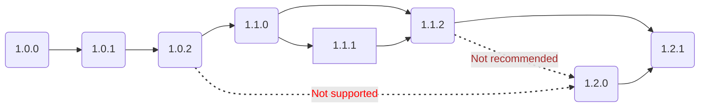

<head>
  <link rel="canonical" href="https://docs.kubewarden.io/reference/upgrade-path"/>
</head>

## Kubewarden stack versioning

The Kubewarden project uses [Semantic versioning](https://semver.org/)
to define the "stack" version of all its components: the version follows the
`MAJOR.MINOR.PATCH` pattern. The supported version is the latest release.

The Kubewarden components that follow the rules for the "stack" version are:

- `kubewarden-crds` chart, in their appVersion field.
- `kubewarden-controller` chart, in their appVersion field.
- `kubewarden-defaults` chart, in their appVersion field.
- `policy-server` image tag for manually deployed ones. The resource for the
  default one is already managed by the `kubewarden-defaults` chart.
- `kwctl` binary.

## Stack version compatibility among components

`kubewarden-crds` chart, `kubewarden-controller` chart, `kubewarden-defaults`
chart, any manually deployed `policy-server` image, and `kwctl` should run the
same `MAJOR`/`MINOR`. The `PATCH` version can increase independently though.

Therefore, if the `kubewarden-controller` version running is `1.1.x`, the
`policy-server`s and `kwctl` version in use should be `1.1.x` as well.

## Helm chart versions

Helm charts define the `version` field and the `appVersion` field. The
`appVersion` field describes the Kubewarden "stack" version as mentioned
before. The `version` field also follows semantic versioning and describes
backwards-compatible changes in the chart templates and `values.yaml`.

## Upgrade paths

When upgrading components, you can upgrade multiple `PATCH` stack versions in a
single operation. However, the upgrade of multiple `MAJOR` or `MINOR` stack
versions in a single upgrade is **not** supported.

For example, you can upgrade components from version `1.1.10` to `1.1.nn` in a
single upgrade. But, the upgrade from `1.1.10` to `1.5.0` isn't supported. In
these cases, you must upgrade individually to each `MAJOR`/`MINOR` version
between the two versions. Therefore, it's necessary to upgrade `1.1.10` to
`1.2.0` then `1.3.0` then `1.4.0` and finally to `1.5.0`. To upgrade from one
`MAJOR` version to another, you need to apply all the `MINOR` updates between
the two `MAJOR` versions.

<figure>

<figcaption>Example upgrade path support graph</figcaption>
</figure>

## Upgrade order

Kuberwarden users should upgrade the stack starting with the `kubewarden-crds`
chart, then the `kubewarden-controller` chart. After that, upgrade the
`policy-server` (via `kubewarden-defaults` chart or bumping the images of
custom ones) and `kwctl`.

## Downgrades

Downgrades are **not** supported, and Kubewarden does not test them.
Nevertheless, there's a reasonable expectation that they should work.

## SDKs, policies

Policy SDKs for the different languages and policies maintained by the
Kubewarden team follow their own semantic versioning. Kubewarden supports the
latest release. There is no need for an upgrade path for them, just a bump to
the latest release.

Changes to the Kubewarden stack may mean that policies and SDKs receive updates
to use the latest Kubewarden features. Kubewarden takes care to perform these
updates in a backwards-compatible manner.

For example, a Kubewarden minor version adding support for Audit Scanner
(`v1.7.0`) means that policies gained a new `spec.backgroundAudit` field. This
is optional, backwards-compatible and set to `true` by default.
