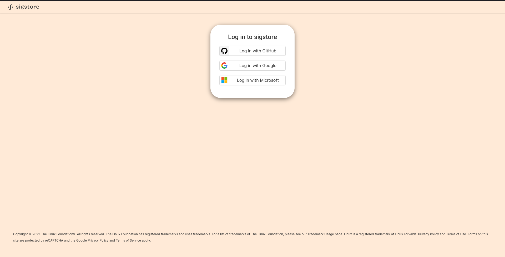

# Secure Supply Chain

Users can configure Kubewarden to run policies signed by only entities that they
trust by using the [sigstore](https://www.sigstore.dev) project. This means that
policy developers can sign their policies and publish them in a registry.
The cluster operators can run these signed policies and ensure the validity of the policies chain of custody


## Signing the policies

Kubewarden recommends using the [cosign](https://github.com/sigstore/cosign) project
for signing policies. This subsection details a key-based method of signing policies
in which, users need to generate a private-public key pair. The generated keys help
in verifying whether the signed artifacts came from the expected user i.e. the
owner of the keys. Using the `cosign generate-key-pair` command, as illustrated
below, it is possible to generate the aforementioned keypair.

```bash
cosign generate-key-pair
Enter password for private key:
Enter password for private key again:
Private key written to cosign.key
Public key written to cosign.pub
```

Once the keys are generated, users can use it to sign policies.

> **WARNING**: The private key file,  `cosign.key`, should not be shared. This
> is a secret file that should be used only by the owner of the key for signing policies.

To sign a policy users can execute the `cosign sign` command passing the `--key`
command line argument with their private key file:

```bash
cosign sign --key cosign.key ghcr.io/jvanz/policies/user-group-psp:latest
an error occurred: no provider found for that key reference, will try to load key from disk...
Enter password for private key:
Pushing signature to: ghcr.io/jvanz/policies/user-group-psp
```

This command will sign the policy and publish the signature data in the registry
as well. Now the policies are ready to be used in a Kubewarden installation with signature
verification enabled.


### Keyless signing

Many times the policies are automatically built in CI/CD pipelines which complicates
the key generation process. For these situations and others where key generation is not
possible, `cosign` has an experimental feature, keyless signing. This allows the users to
sign policies without a previously created key. By using
[Fulcio](https://github.com/sigstore/fulcio), ephemeral keys are generated that can be used to
sign the artifact only once.

To ensure the identity of the user for these keys, Fulcio uses an OIDC provider
to generate the ephemeral keys. This means that, during the signing process users
must sign-in using one of the OIDC providers, as shown in the below image:




After signing in, `cosign` will finish the signing process.

However, as of this writing, this feature is not enabled by default
in `cosign`. So, it's necessary to enable this experimental feature before
proceeding with keyless signing as shown below:

```bash
 COSIGN_EXPERIMENTAL=1 cosign sign ghcr.io/jvanz/policies/user-group-psp:latest
Generating ephemeral keys...
Retrieving signed certificate...
Your browser will now be opened to:
https://oauth2.sigstore.dev/auth/auth?access_type=online&client_id=sigstore&code_challenge=<REDACTED>&code_challenge_method=S256&nonce=<REDACTED>&redirect_uri=http%3A%2F%2Flocalhost%3A34021%2Fauth%2Fcallback&response_type=code&scope=openid+email&state=<REDACTED>
client.go:196: root pinning is not supported in Spec 1.0.19
Successfully verified SCT...
tlog entry created with index: 1819248
Pushing signature to: ghcr.io/jvanz/policies/user-group-psp
```

### How to sign artefacts in Github workflows

`cosign` does not require the user to log on to an OIDC provider when using keyless signing
in the context of a GitHub action environment. In this scenario,
the Github token available during the execution of the workflow will be used to
authenticate the user and generate the ephemeral keys.

## Verifying policies

Users can check if a policy is properly signed with  `cosign` or `kwctl`.
Both have similar command line flags which allow users to check the policy
signatures. To check if the binary is signed with a key, the users can use `kwctl`
like this:

```shell
kwctl verify -k cosign.pub ghcr.io/jvanz/policies/user-group-psp:latest
2022-03-29T14:49:16.623079Z ERROR policy_fetcher::registry::config: error parsing host configuration, host ignored host=https://index.docker.io/v1/ error=basic auth not in the form username:password
2022-03-29T14:49:31.878180Z  INFO kwctl::verify: Policy successfully verified
```

Or `cosign` :

```bash
cosign verify --key cosign.pub ghcr.io/jvanz/policies/user-group-psp:latest

Verification for ghcr.io/jvanz/policies/user-group-psp:latest --
The following checks were performed on each of these signatures:
  - The cosign claims were validated
  - The signatures were verified against the specified public key
  - Any certificates were verified against the Fulcio roots.

[{"critical":{"identity":{"docker-reference":"ghcr.io/jvanz/policies/user-group-psp"},"image":{"docker-manifest-digest":"sha256:af520a8ccee03811d426c48634b7007f1220c121cc23e14962bb64510585ce97"},"type":"cosign container image signature"},"optional":null}]
```

### Signature verification file

Users can also provide a file with all the signature requirements they want to validate. A sample file is shown below:

```yaml
apiVersion: v1

allOf:
  - kind: githubAction
    owner: kubewarden   # mandatory
    annotations:
      env: prod

anyOf: # at least `anyOf.minimumMatches` are required to match
  minimumMatches: 2 # default is 1
  signatures:
  - kind: pubKey
    owner: flavio # optional
    key: .... # mandatory
    annotations:  # optional
      env: prod
      foo: bar
  - kind: pubKey
    owner: victor # optional
    key: .... # mandatory
  - kind: genericIssuer
    issuer: https://github.com/login/oauth
    subject:
      equal: alice@example.com
  - kind: genericIssuer
    issuer: https://token.actions.githubusercontent.com
    subject:
      equal: https://github.com/flavio/policy-secure-pod-images/.github/workflows/release.yml@refs/heads/main
  - kind: genericIssuer
    issuer: https://token.actions.githubusercontent.com
    subject:
      urlPrefix: https://github.com/flavio/
  - kind: genericIssuer
    issuer: https://token.actions.githubusercontent.com
    subject:
      urlPrefix: https://github.com/kubewarden # <- it will be post-fixed with `/` for security reasons
  - kind: githubAction
    owner: flavio   # mandatory
    repo: policy1 # optional
  - kind: pubKey
    owner: alice # optional
    key: .... # mandatory
```

The configuration is composed of two sections:

- `anyOf`:  The policy will be trusted if the `minimumMatches` criterion is fulfilled.
In the above example, the `minimumMatches` field has been assigned a value 2.
This means that at least two of the signature requirements listed **need to be fulfilled**
for the policy to be trusted. The default value that the `minimumMatches` field assumes is `1`.
- `allOf`: All the signatures requirements defined in this section must be valid
so that the policy can be trusted.

Each of these sections can contain one or more signature requirements.
Users can also define both sections in one file as shown above. In this situations, all
the signatures requirements from the `allOf` **AND** a minimum number of matches
from the `anyOf` section as described in the `minimumMatches` field must be valid.

#### Signature validation

The users can validate deferents signatures validations in the `anyOf` and
`allOf` sections. It's possible to validate the public key and the keyless data
used to sign the policy.

#### Public key validation

To check if the policy is assigned with the given public key, the users can
define the key data and the owner of the key used to sign the policy. As illustrated
bellow, it is necessary to define the kind as `pubKey` and insert the public
key data in the `key` field. The owner field is optional.

**Example**

```  yaml
  - kind: pubKey
    owner: bob # optional
    key: |
      -----BEGIN PUBLIC KEY-----
      MBFKHFDGHKIJH0CAQYIKoZIzj0DAQcDQgAEX0HFTtCfTtPmkx5p1RbDE6HJSGAVD
      BVDF6SKFSF87AASUspkQsN3FO4iyWodCy5j3o0CdIJD/KJHDJFHDFIu6sA==
      -----END PUBLIC KEY-----
```

#### Keyless signatures validation

When signed in keyless mode, we do not have the public key to verify. In this
situation the users can verify the field filled with the OIDC data used during
the signing process. For that, it's necessary to define the kind of the signature
validation as `genericIssuer`. Therefore, it's possible to verify three piece
of information from the signature:

- `issuer`(mandatory): matches the `Issuer` attribute in the certificate
generated by Fulcio. This shows the OIDC used to sign the policy
- `subject`: field used to match the `Subject` attribute in the Fulcio's
certificate. The `Subject` field contains the information of the user used to
authenticate in the OIDC provider. The verification field, `subject`, can have
two children fields: `equal` forces the `Subject` from the certificate to be
equal to the value defined in the signature validation; `urlPrefix` forces the
value of the certificate's `Subject` field value to be prefixed by the value
defined in the signature requirement.

**Examples**

The following signature requirement asks the policy to be keyless signed by Alice
using the Github OIDC:

```yaml
- kind: genericIssuer
  issuer: https://github.com/login/oauth
  subject:
    equal: alice@example.com
```

This signature requirement enforces that the policy by signed in a Github actions
from a repository owner by Flavio:

```yaml
- kind: genericIssuer
  issuer: https://token.actions.githubusercontent.com
  subject:
    urlPrefix: https://github.com/flavio
```

#### Github actions signing validation

This signature validation kind is used to validate policies signed in Github
Actions. This can also be achieve with the `genericIssuer` kind as well. But
this kind simplify the signature requirement creation by defining two fields:

- `owner` (mandatory): Github ID of the user or organization to be trusted
- `repo`: the name of the repository to be trusted

**Example**

```yaml
- kind: githubAction
  owner: kubewarden
```

#### Signature annotations validation

All the signature types can have one additional optional validation field, `annotations`.
This fields are key/value data added by the users during the signing. Thus, it is
possible to trust policies which have some required annotations.

**Examples**

If the users want to trust only policies which have been signed with some key
and the annotation `environment` with the value `production`, they can define the
following validation:

```yaml
- kind: pubKey
  key: |
    -----BEGIN PUBLIC KEY-----
    MBFKHFDGHKIJH0CAQYIKoZIzj0DAQcDQgAEX0HFTtCfTtPmkx5p1RbDE6HJSGAVD
    BVDF6SKFSF87AASUspkQsN3FO4iyWodCy5j3o0CdIJD/KJHDJFHDFIu6sA==
    -----END PUBLIC KEY-----
  annotation:
    environment: production
```


#### How to use signatures verification file to check a policy OCI artifact

To test if a given policy passes in the signatures verification using the
verification file, use the `--verification-config-path`  flag of the `kwctl verify` command

```bash
cat signatures_requirements.yaml
apiVersion: v1
allOf:
  - kind: pubKey
    key: |
      -----BEGIN PUBLIC KEY-----
      MFkwEwYHKoZIzj0CAQYIKoZIzj0DAQcDQgAE5Q+cN1Jj2S7N05J4AXnqwP2DyzSg
      Mc+raYce2Wthrd30MSgFtoh5ADAkCd/nML2Nx8UD9KBuASRb0gG5jXqgMQ==
      -----END PUBLIC KEY-----

kwctl verify --verification-config-path signatures_requirements.yaml ghcr.io/jvanz/policies/user-group-psp:latest
2022-03-29T17:34:37.847169Z  INFO kwctl::verify: Policy successfully verified
```

While the previous example tests if the policy is signed by the given key,
the next one checks if a given policy came from the Kubewarden organization:

```bash
cat kubewarden_signatures.yaml
apiVersion: v1
allOf:
  - kind: githubAction
    owner: kubewarden

kwctl verify --verification-config-path kubewarden_signatures.yaml ghcr.io/kubewarden/policies/user-group-psp:latest
2022-03-29T18:07:39.062292Z  INFO kwctl::verify: Policy successfully verified
```

## Configuring the policy server to check policy signatures

To configure Kubewarden to run only trusted policies, the users must create
`configmap` with the minimum signatures requirements to allow a policy to be
executed in the environment. The `configmap` follows the same structure of the
file used to verify policy in the `kwctl` utility. The only difference in this
case would be that the `configmap` should define all the configurations under
the `verification-config` field.  For example, let's consider that the users
want to run policies signed by the Kubewarden organization. A sample `configmap`
for this scenario has been illustrated below:

```bash
cat kubewarden_signatures.yaml
apiVersion: v1
allOf:
  - kind: githubAction
    owner: kubewarden

# note that the data is stored under verification-config field
kubectl  create configmap my-signatures-configuration --from-file=verification-config=kubewarden_signatures.yaml

kubectl  get configmap -o yaml my-signatures-configuration
apiVersion: v1
data:
  verification-config: |
    apiVersion: v1
    allOf:
      - kind: githubAction
        owner: kubewarden
kind: ConfigMap
metadata:
  creationTimestamp: "2022-03-29T18:27:20Z"
  name: my-signatures-configuration
  namespace: default
  resourceVersion: "10279"
  uid: d53e1c56-1fee-45de-92f5-9bd73b8cead4

```


After creating the `configmap` to store the signature requirements, the users
can configure a Policy Server to start validating policy signatures by setting the
`configmap` name in the field `verificationConfig`.

```yaml
apiVersion: policies.kubewarden.io/v1alpha2
kind: PolicyServer
metadata:
  name: default
  finalizers:
    - kubewarden
spec:
  image: ghcr.io/kubewarden/policy-server:v0.2.7
  serviceAccountName: policy-server
  replicas: 1
  verificationConfig: your_configmap   #name of the confimap with the signatures requirements
  env:
    - name: KUBEWARDEN_ENABLE_METRICS
      value: "1"
    - name: KUBEWARDEN_LOG_FMT
      value: otlp
    - name: "KUBEWARDEN_LOG_LEVEL"
      value: "info"

```

If you deploy the default Policy Server using the `kubewarden-defaults`
Helm chart, you can configure this field by setting the `configmap` name in the
`policyServer.verificationConfig` value.

Now, when an untrusted policy is installed the Policy Server will exit before
it starts receiving any admission review requests.
